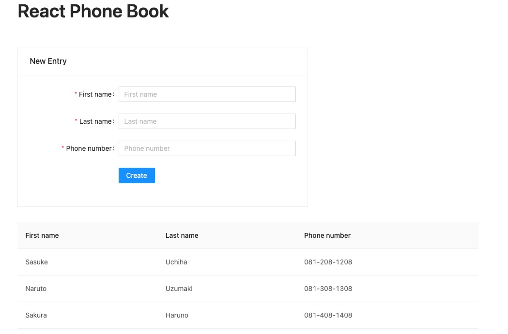
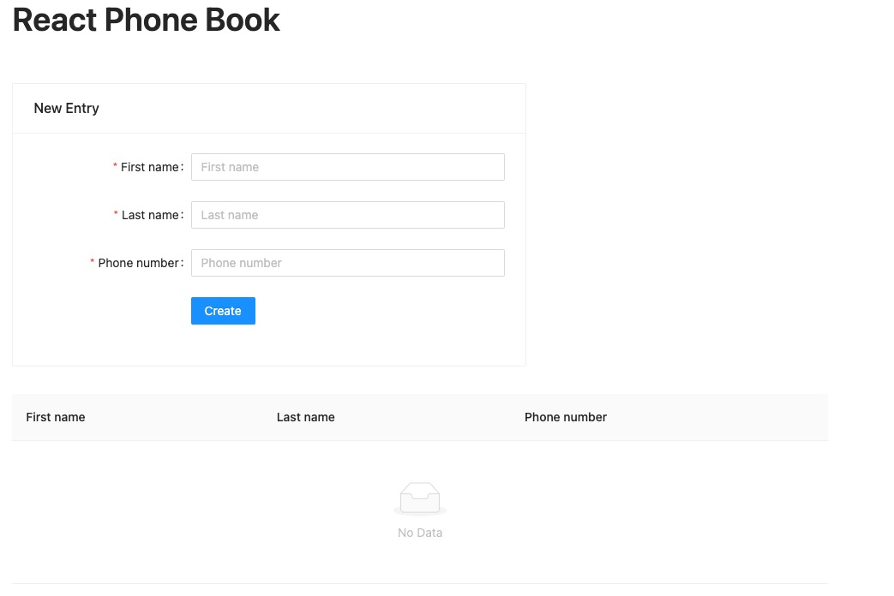
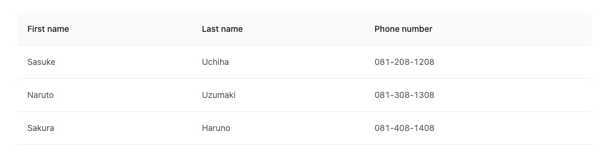
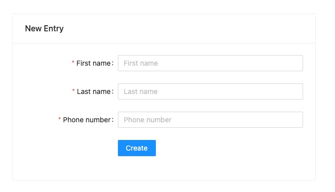

# FERN-P1-S1LC02 - React Phone Book

## Ringkasan

React Phone Book adalah aplikasi untuk menyimpan nomor telepon rekan kerabat kalian agar kalian tetap bisa menjalin komunikasi dengannya. Aplikasi ini dapat menyimpan nomor dan kita bisa melihat list nomor telepon tersebut. Semoga sukses!

## Aturan & Kebijakan

- Waktu Pengerjaan: **150 min**
- Rubric score terdapat pada setiap release dan bisa dikerjakan secara acak (tidak harus diselesaikan secara berurutan), lakukan strategi yang tepat agar mendapatkan score maksimal!
- Student diharapkan menjunjung tinggi INTEGRITAS. Segala bentuk ketidakjujuran meliputi peniruan, plagiarisme, pemalsuan pengerjaan akan mendapatkan tindakan tegas dari akademik

## Bobot Penilaian

- Basic Web Development
- CSS Styling & Layouting
- Basic JS syntax & flow
- API Integration
- UI Library (React.js)

## Github Live Code Workflow

Dalam pengerjaan live code, kalian diminta untuk melakukan commit sebagai checkpoin pengerjaan. Jika pengerjaan release sudah selesai atau instructor meminta commit, segera lakukan `add-commit` dengan message relase yang jelas.

- Contoh 1: git commit -m "Release 0 Done"
- Contoh 2: git commit -m "Release 3 - Fetch Vouchers: Done"
- Contoh 3: git commit -m "Checkpoin 1 dari instructor"

## Release 0 - Setup Project (10)

Lakukan setup project dengan menginstall package yang sudah diajarkan sebelumnya seperti vite dan react.js serta package lain yang kalian butuhkan. Pada project ini terdapat assets pada folder `result` sebagai referensi tampilan web yang diharapkan. Kalian boleh menggunakan framework CSS favorite kalian pada project ini. Lakukan:

1. Buatlah project React dengan nama `client`
2. Pada bagian `server`, Install package menggunakan `npm install` dan jalankan `json-server` pada port `3000`

Catatan:
Tampilan Client Side pada assets hanya sebagai referensi atau contoh tampilan, kalian boleh menyesuaikan tampilan ASALKAN layout atau tata letak komponen sama dengan assets yang sudah diberikan. Kalian boleh fokus untuk menyelesaikan feature dahulu lalu akhiri dengan tampilan yang rapi dan menarik.

## Release 1 - Home Page (25)

Buatlah halaman home dengan menampilkan FORM untuk menambahkan contact baru dan LIST contact yang sudah disimpan. Pada release ini kalian fokus slicing HTML CSS. Layout tampilan sesuai dengan gambar berikut 

## Release 2 - Connect Server (25)

Pada table Contact, tampilkan data contact berdasarkan data yang berada pada server dengan detail sebagai berikut:

1. Lakukan GET `http://localhost:3000/contacts` pada server `json-server` untuk mendapatkan data
2. Tampilkan data yang sudah difetch tersebut pada UI table yang sudah disiapkan
3. Hasil yang akan muncul adalah sebagai berikut 
4. Untuk tampilan `Phone Number`, kalian boleh menampilkan dalam bentuk `0812081208`, kalian bisa ubah menjadi `081-208-1208` pada release terakhir

## Release 3 - Create Contact (25)

Lakukan intergasi pada FORM `Create Contact` ke server yang sudah dibuat dengan detail sebagai berikut:

1. Terdapat 3 FORM yang berisi: `firstName`, `lastName`, `phoneNumber`
2. Lakukan POST `http://localhost:3000/contacts` ke server `json-server` untuk mengirim data
3. Pastikan ketika proses create berhasil, maka input FORM akan kosong kembali 
4. Pastikan ketika proses berhasil, maka contact baru akan bertambah secara reaktif pada table
5. Untuk validasi form, kalian bisa buat pada release terakhir

## Release 4 - Make it Perfect (15)

Lakukan feature tambahan berikut agar aplikasi kalian menjadi lebih baik:

1. Pada tampilan `Phone Number`, buatlah perubahan tampilan nomor dimana setiap 3 angka pertama dan kedua, maka terdapat dash atau `-`, contoh: `0812081208` menjadi `081-208-1208`
2. Buat validasi, jika salah satu input FORM tidak diisi, maka user tidak dapat membuat contact baru
3. Tampilan akhir akan seperti 
